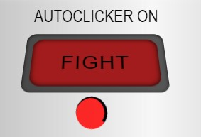
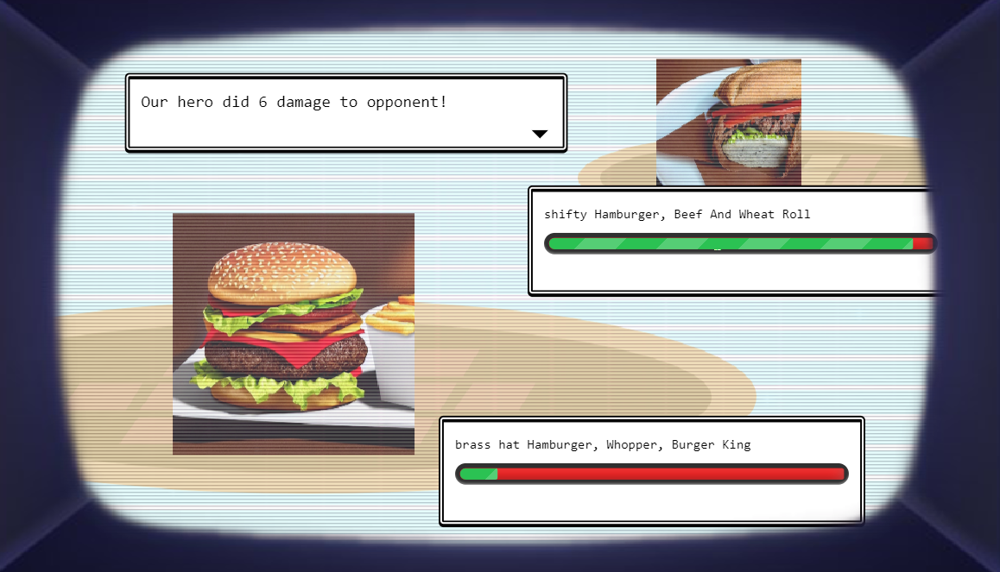
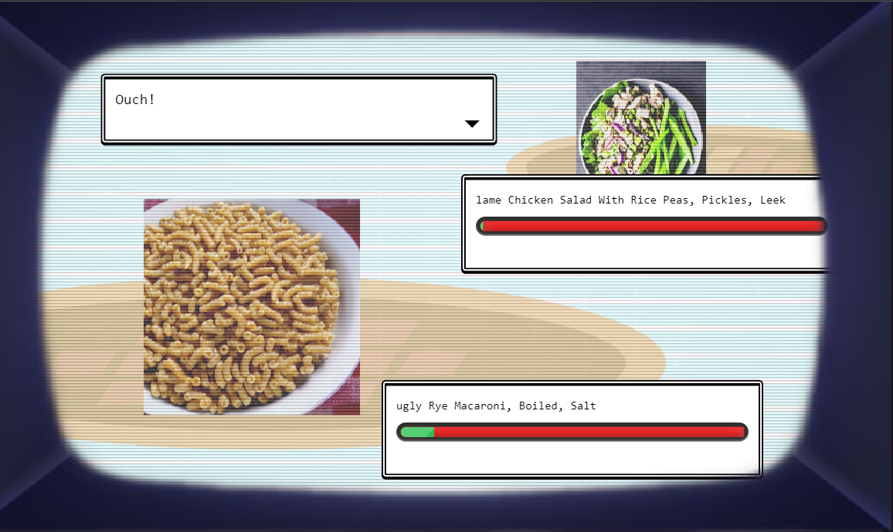

# Fullstack Edible Battle
 Game based on Solidabis challenge about foods battling against each other based on nutrition values
 <hr>

### QUICK NOTES

#### NOT A RELEASE OR READY FOR IT FOR A WHILE
#### NO TESTS IMPLEMENTED FOR TIMELY REASONS (COULD'VE BUT GOT LIFE)

* You can play this game at
  * https://veggiebattle.miskahannunkivi.fi/game
    * want even better experience?
      * [twitch-mode](https://veggiebattle.miskahannunkivi.fi/game/twitch)
      * [survival-mode](https://veggiebattle.miskahannunkivi.fi/game/survival)
      * [twitch-survival-mode](https://veggiebattle.miskahannunkivi.fi/game/twitch/survival)
  * no authentication implemented yet - working on it.
  * no mobile support - its just plain ugly. Working on it.
* @Localhost
  * Docker
    * run "docker-compose-dev" -script at root (linux .sh or windows .bat)
  * native ( ```node & dotnet```)
    * cd frontend 
      * npm run start-dev
    * cd backend/VeggieBattleBackend
      * dotnet run


  #### Remember autoclicker to rescue :D (those 1 hp per attacks are cumbersome)
   
### Why tho
 It was fun experiment because always wanted to create games but haven't had motivating oppoturnities for it.

 <hr>
 
| Frontend | Backend |
|--|--|
|  |  |
| *Angular 14.2* |  *.NET 6 Web API* 

 

<br>


 Developed in 

<hr>

Developed with 
<hr>

Tested in 
<hr>

###  TODO

 - [x] Game working with minimal logic in development mode
 - [x] Game working in production mode
 - [x] Containerized game to run with one-liner
 - [x] Game to work in a loop so there can be enemy after enemy so "body count" can be incremented after winning a match
 - [ ] "*Partially done*" Offline mode fully supported (every 3rd party API call to be with offline fall logic)
 - [ ] LOL those horrible animations to life :D
 - [ ] Fix development environment (did go crazy when opted for production containers)
 - [ ] Give credit where credit is due (many websites and friends and solidabis (the company i guess) who inspired me & yeezy ofc
 - [ ] Create shortcuts to survival and twitch modes from "main screen"
 - [ ] That "main menu"
 - [ ] Lvl system based on attack + hp (maybe defence)
 - [ ] Mobile support
 - [ ] SAVE/LOAD game states through staticFiles (backend dotnet-thing)
 - [ ] Ingame Help (its so hard to push 1-button once or a little to activate autoclicker) BRUH
 - [ ] oh and last, better support for peasant/pleb browsers (other than chrome)

## Description

This project is based on a contest where two different foods fight against each other by "comparing" their nutritional values.

*Task is given but the rest is pure passion.*

## Table of Contents

-  [Installation](#installation)

-  [Usage](#usage)

-  [Credits](#credits)

-  [License](#license)

## Installation


## Frontend

should've used `yarn` but did everything in a hurry.

### Building and running
Regular Angular project, just install and run. Or build and deploy. **(Production settings **Not yet** implemented)**

    npm i
    ng serve

> or

    npm i
    ng build
    npm install -g angular-http-server
    cd dist/veggie-battle-frontend
    angular-http-server

## Backend

Uses dotnet 6 and has swagger build-in `localhost:[port]/swagger`

### Building and running
to build and run just type **(Production settings **Not yet** implemented)**

    dotnet run
or

    dotnet build
    cd bin\Debug\net6.0\
    .\VeggieBattleBackend.exe

### dotnet user-secrets
you should have DeepAIApiKey in user secrets for this project (get your own from DeepAI-website if this won't work):

    {
        "DeepAIApiKey":"quickstart-QUdJIGlzIGNvbWluZy4uLi4K"
    }

add it with dotnet CLI at VeggieBattleBackend Project-folder:

     dotnet user-secrets set "DeepAIApiKey" "quickstart-QUdJIGlzIGNvbWluZy4uLi4K"


## Usage

Usage is simple - you have 3 buttons which does something and only 1 of them continues the game. 
Everything is done for the user, so user should just have luck within in this one.

 

## Tests

Tests are not forgotten but not yet implemented - started as a hobby project with no excessive whiteboard planning so that's why tests come in later.

## Credits

Gonna be big list of inspiration sites and stuff.

## License

MIT License

Copyright (c) 2022 [Maiska](https://github.com/Maiska123)

Permission is hereby granted, free of charge, to any person obtaining a copy
of this software and associated documentation files (the "Software"), to deal
in the Software without restriction, including without limitation the rights
to use, copy, modify, merge, publish, distribute, sublicense, and/or sell
copies of the Software, and to permit persons to whom the Software is
furnished to do so, subject to the following conditions:

The above copyright notice and this permission notice shall be included in all
copies or substantial portions of the Software.

THE SOFTWARE IS PROVIDED "AS IS", WITHOUT WARRANTY OF ANY KIND, EXPRESS OR
IMPLIED, INCLUDING BUT NOT LIMITED TO THE WARRANTIES OF MERCHANTABILITY,
FITNESS FOR A PARTICULAR PURPOSE AND NONINFRINGEMENT. IN NO EVENT SHALL THE
AUTHORS OR COPYRIGHT HOLDERS BE LIABLE FOR ANY CLAIM, DAMAGES OR OTHER
LIABILITY, WHETHER IN AN ACTION OF CONTRACT, TORT OR OTHERWISE, ARISING FROM,
OUT OF OR IN CONNECTION WITH THE SOFTWARE OR THE USE OR OTHER DEALINGS IN THE
SOFTWARE.

---
